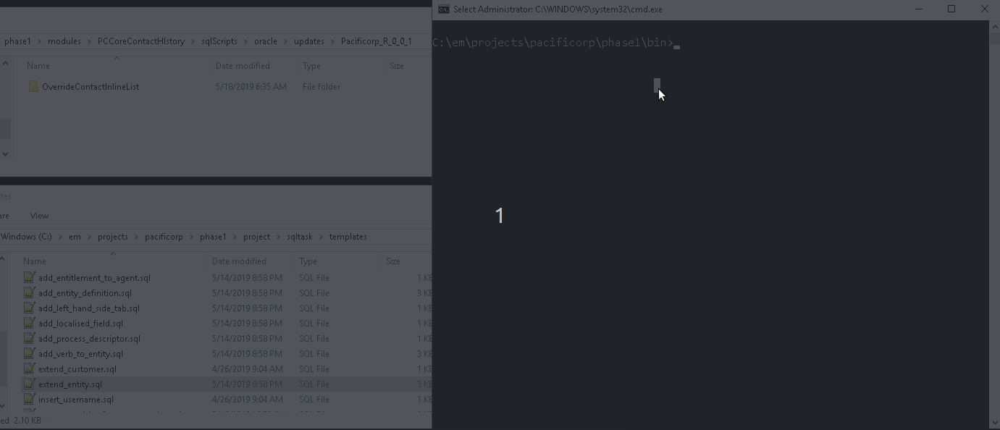

[library]: https://github.com/vecin2/sqltask-templates

## sqltask

`sqltask` is a command line SQL generator which aims to be used within EO projects.

Overriding a verb, extending an entity, creating and assigning entitlements or creating new KM content types, are just some examples of tasks that are implemented using SQL scripts. 

The current method developers follow when creating these scripts, involves finding similar examples from previous projects and use them as templates, keeping most of the SQL and just replacing some values. 

However, keeping track of all of this SQL is not that simple as the list of SQL tasks is very large and, it keeps growing as the product becomes more configurable. This is specially the case for tasks that required a lot of SQL or, tasks that are not as frequent, where is harder to find similar examples and, sometimes, they require developers having to reverse engineering in order to work out the SQL. After all this work, the script is buried into a project repository with limited visibility to other developers.

`sqltask` is based on this idea of using previous scripts as templates. It uses a library of SQL tasks, where a task is implemented by a template, which is basically a SQL file with placeholders for those values that would typically changed. Then, it uses fuzzy searching to help finding a specific template. Once the template is selected, the the tool parses its placeholders and it prompts them to the user, with helpers like, default values or auto-suggestions, to facilitate this whole process.

There is an existing [library] which already has many different SQL tasks and, and it encourages developers to add more tasks as they work on new SQL required by their projects. This makes it available for future uses and also to other developers.

## Table Of Contents

- [User installation](#user-installation)
  * [Library](#library)
  * [Windows Executable](#windows-executable)
  * [Configuration](#configuration)
  * [Database Client](#database-client)
    + [Oracle Client](#oracle-client)
- [Test Installation: First Run](#test-installation--first-run)
  * [Run Tests](#run-tests)
- [Hello World](#hello-world)
- [User Guide](#user-guide)
- [Designer Guide](#designer-guide)

## User installation

### Library
Clone the SQL task [library] into any folder within your filesystem. 

The same library can serve multiple projects. Take this into account when choosing the folder as it would make sense to keep it out of any specific project, in a general location like  `c:\em\sqltask-library`.

Later on, the [configuration](#configuration) step ask for this path when setting the property `sqltask.library.path`, which defines which SQL tasks  are available to `sqltask`

### Windows Executable
Download [sqltask.exe](releases) and save it in any location within the `%PATH%` environment variable. 

Add a new folder to `%PATH%` environment variable or use an existing one, for example `%USERPROFILE%\AppData\Local\Microsoft\WindowsApps`

 Run `sqltask.exe` from the root folder of an EO project or any subfolder, a help message should be printed.
 
### Configuration
Open the command line, navigate to a folder inside an EO project and run `sqltask init`

Follow the instructions on the screen when entering the configuration settings.  They are written to `<<project.home>>/project/sqltask/config/core.properties`

Settings can be adjusted by running the `init` command again or  by directly editing the `core.properties` file.

### Database Client

`sqltask` connects to a database and therefore requires a database client to be installed.
The type of client depends on whether the project uses oracle database or SQL server.

#### Oracle Client

If the system already has an oracle database installed and available within `%PATH%` this step could be skipped.

On the [downloads](https://www.oracle.com/database/technologies/instant-client/winx64-64-downloads.html) section of the oracle web site, find the package matching the project's database version and download the appropriate "Basic Light Package". For example if your project has oracle 19, download the latest oracle 19 `Basic Light Package` which, at the time of this writing, is `instantclient-basiclite-windows.x64-19.18.0.0.0dbru.zip`.

Unzip it to any folder, for example : `C:\Oracle\instantclient_19_18`

Add this path to `%PATH%` within your user environment variables

## Test Installation: First Run

Open the command line and navigate to a folder within an EO project:
- Run `sqltask.exe print-sql` it should start the application and prompt for a template name.
- Start typing the name. It should trigger the fuzzy searcher and bring up a list of templates matching the input entered.
- Select a template and hit `<Enter>`. At this point the application looks for configuration under `work/config/show-config-txt` and, if it doesn't find it, runs   `ccadmin show-config -Dformat=txt`, which is required to get the project's configuration including database connections details.
- Enter the values to fill the template's placeholders
- After all the values are entered, select template menu is displayed again.
- Select option `x. Save && Exit` to finish. 
- The rendered SQL should be printed.

### Run Tests

Run [sqltask.exe test-sql](docs/UserGuide.md#test-sql) to check the templates are still valid for the current product version

## Hello World

Create a `hello_world.sql` file under `<<sqtask.library.path>>/templates` folder with the following content: `Hello {{ name }}!`
Run `sqltask print-sql` and select the template `hello_world.sql`.
You should see `name` being prompted. Enter a value and press enter.
Finally type 'x' to save and exit. 
You should see the generated template printed on the console.

## User Guide

For details on the specific commands  please refer to the user guide [here](docs/UserGuide.md).

## Designer Guide

For details on how to write new templates please refer to the designer guide [here](docs/TemplateDesignerGuide.md)
